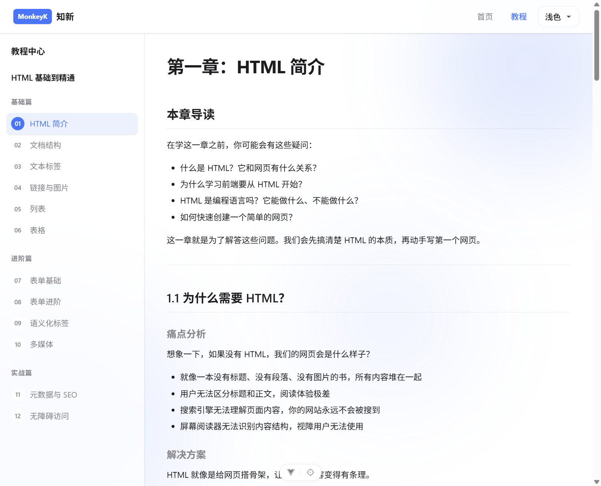

# 全栈学习平台

一个基于 Vue 3 + Vite 构建的在线技术教程平台，提供系统化的编程学习资源。

**在线预览**：[https://www.monkeyk.cn/](https://www.monkeyk.cn/)

## 项目特色

- **多系列教程**：涵盖前端、后端、操作系统、网络、DevOps 等多个领域
- **结构化学习**：每个系列分为基础篇、进阶篇、实战篇，循序渐进
- **现代化 UI**：支持主题切换、响应式设计、平滑导航
- **代码高亮**：支持多种编程语言的语法高亮显示
- **移动端适配**：完美适配手机、平板、桌面端

## 界面预览

### 首页


### 教程中心


### 章节内容



## 项目结构

```
vue3-study/
├── src/
│   ├── components/       # 通用组件
│   ├── composables/      # 组合式函数
│   ├── content/tutorials/ # 教程内容（Markdown）
│   ├── data/            # 教程数据配置
│   ├── layouts/         # 页面布局
│   ├── router/          # 路由配置
│   ├── views/           # 页面视图
│   └── assets/          # 静态资源
├── public/              # 公共文件
└── package.json         # 项目配置
```

## 教程系列

### 前端开发

| 教程名称             | 章节数 | 简介                  | 查看链接                                                                   |
| ---------------- | --- | ------------------- | ---------------------------------------------------------------------- |
| HTML 基础到精通       | 12  | 从零开始学习 HTML，构建语义化网页 | [src/content/tutorials/html](src/content/tutorials/html)               |
| CSS 完全指南         | 12  | 从基础样式到现代布局          | [src/content/tutorials/css](src/content/tutorials/css)                 |
| JavaScript 核心教程  | 12  | 掌握 JavaScript 核心概念  | [src/content/tutorials/javascript](src/content/tutorials/javascript)   |
| TypeScript 从零到精通 | 12  | TypeScript 基础到实战    | [src/content/tutorials/typescript](src/content/tutorials/typescript)   |
| Vue 2 经典教程       | 16  | Vue 2 选项式 API 与生态   | [src/content/tutorials/vue2](src/content/tutorials/vue2)               |
| Vue 3 完全指南       | 16  | Vue 3 组合式 API 与核心特性 | [src/content/tutorials/vue3](src/content/tutorials/vue3)               |
| Vite 完全指南        | 16  | 下一代前端构建工具           | [src/content/tutorials/vite](src/content/tutorials/vite)               |
| npm 完全指南         | 16  | Node.js 包管理与项目工作流   | [src/content/tutorials/npm](src/content/tutorials/npm)                 |
| 前端性能优化实战         | 16  | 系统掌握性能优化技术          | [src/content/tutorials/performance](src/content/tutorials/performance) |

### 后端开发

| 教程名称        | 章节数 | 简介             | 查看链接                                                     |
| ----------- | --- | -------------- | -------------------------------------------------------- |
| Java 从入门到精通 | 16  | Java 基础语法到面向对象 | [src/content/tutorials/java](src/content/tutorials/java) |
| Spring 完全指南 | 16  | 从 Spring 核心到 Spring Boot 实战 | [src/content/tutorials/spring](src/content/tutorials/spring) |
| Spring 原理深度解析 | 16  | 深入 Spring 底层，掌握 IoC、AOP、自动配置等核心原理 | [src/content/tutorials/spring-principle](src/content/tutorials/spring-principle) |
| JVM 核心原理与实战 | 16  | 深入理解 Java 虚拟机，掌握内存管理、垃圾回收、性能调优核心技术 | [src/content/tutorials/jvm](src/content/tutorials/jvm) |

### 计算机基础

| 教程名称       | 章节数 | 简介             | 查看链接                                                                           |
| ---------- | --- | -------------- | ------------------------------------------------------------------------------ |
| 操作系统核心教程   | 16  | 进程、内存、文件系统核心概念 | [src/content/tutorials/os](src/content/tutorials/os)                             |
| 数据结构完全教程   | 16  | 数组、链表、树、图等核心概念 | [src/content/tutorials/data-structures](src/content/tutorials/data-structures) |

### 数据库

| 教程名称          | 章节数 | 简介                            | 查看链接                                               |
| ------------- | --- | ----------------------------- | -------------------------------------------------- |
| MySQL 从入门到精通 | 16  | 从基础 SQL 到性能优化与高可用集群实战 | [src/content/tutorials/mysql](src/content/tutorials/mysql) |

### 网络

| 教程名称       | 章节数 | 简介         | 查看链接                                                                           |
| ---------- | --- | ---------- | ------------------------------------------------------------------------------ |
| 浏览器与网络基础教程 | 16  | 浏览器原理与网络协议 | [src/content/tutorials/browser-network](src/content/tutorials/browser-network) |

### DevOps

| 教程名称       | 章节数 | 简介            | 查看链接                                                   |
| ---------- | --- | ------------- | ------------------------------------------------------ |
| Git 版本控制教程 | 16  | 高效管理代码版本与团队协作 | [src/content/tutorials/git](src/content/tutorials/git) |

启动开发服务器后，可以通过以下路由访问：

- 教程中心首页：`/tutorials`
- 具体系列页面：`/tutorials/{seriesId}`
- 具体章节页面：`/tutorials/{seriesId}/{chapterSlug}`

## 技术栈

- **框架**: Vue 3.5+ (Composition API)
- **构建工具**: Vite 8.1+
- **路由**: Vue Router 5.0+
- **状态管理**: Pinia 3.0+
- **语言**: TypeScript 6.0+
- **样式**: CSS3 + CSS Variables
- **Markdown**: markdown-it + highlight.js

## 快速开始

### 环境要求

- Node.js >= 20.19.0 或 >= 22.12.0
- pnpm >= 8.0.0

### 安装依赖

```bash
pnpm install
```

### 开发模式

```bash
pnpm format
```

访问 <http://localhost:5173> 查看应用。

### 构建生产版本

```bash
pnpm build
```

### 预览生产版本

```bash
pnpm preview
```

### 代码格式化

```bash
pnpm format
```

## 开发说明

### 如何添加新教程

添加新教程分为三个步骤，按照以下流程操作即可：

#### 步骤一：创建教程目录

在 `src/content/tutorials/` 目录下创建新系列的文件夹，文件夹名称使用小写英文，单词之间用连字符分隔。

示例：创建 React 教程系列

```bash
mkdir src/content/tutorials/react
```

#### 步骤二：注册教程系列

在 `src/data/tutorial-series.ts` 文件中注册新的教程系列。

示例代码：

```typescript
{
  id: 'react',
  title: 'React 完全指南',
  description: '深入学习 React 核心概念与现代开发模式',
  category: 'frontend',
  chapters: [
    {
      number: '01',
      title: 'React 简介与环境搭建',
      description: '什么是 React，如何创建 React 项目',
      section: '基础篇',
      slug: 'introduction',
    },
    {
      number: '02',
      title: '组件与 Props',
      description: '组件的定义与属性传递',
      section: '基础篇',
      slug: 'components-props',
    },
  ],
}
```

字段说明：

- `id`：系列唯一标识，小写英文，与目录名一致
- `title`：系列显示名称
- `description`：系列简介
- `category`：分类，可选值：`frontend`、`backend`、`system`、`network`、`devops`
- `chapters`：章节列表
  - `number`：章节编号，两位数字（01-99）
  - `title`：章节标题
  - `description`：章节简介
  - `section`：章节所属部分，可选值：`基础篇`、`进阶篇`、`实战篇`
  - `slug`：章节 URL 标识，小写英文，与文件名一致

#### 步骤三：创建章节内容

在教程目录下创建 Markdown 文件，文件命名格式为 `{number}-{slug}.md`。

### 教程编写规范

每章教程必须包含以下八个部分：

1. **本章导读**：列出 3-4 个新手常见疑问，说明本章会解决什么问题
2. **技术必要性分析**：对比没有这个技术时的痛点，用生活化类比解释技术价值
3. **核心原理讲解**：解释底层原理，用通俗类比帮助理解，对比不同方案的差异
4. **基础用法**：代码示例每行都要有中文注释，用对比标记正确和错误写法
5. **进阶用法**：展示更复杂的用法和实际应用场景
6. **核心知识点总结**：用表格清晰展示关键知识点
7. **新手常见误区**：列出 3-5 个新手容易犯的错误，解释为什么错和正确做法
8. **下一章预告**：简要说明下一章会学什么，引导学习路径

### 代码示例要求

- 代码要完整可运行
- 每行都要有中文注释，解释这行在做什么和为什么这样写
- 使用对比标记正确和错误写法
- 复杂代码要分步骤讲解

### 路由说明

教程页面路由采用自动匹配机制：

- `/tutorials`：教程中心首页
- `/tutorials/:seriesId`：系列索引页，展示该系列所有章节
- `/tutorials/:seriesId/:chapterSlug`：章节内容页

无需手动配置路由，系统会根据 `tutorial-series.ts` 自动生成。

### 开发流程建议

可使用 skill 进行自动生成

1. 先规划教程系列的整体大纲和章节结构
2. 在 `tutorial-series.ts` 中注册所有章节的元数据
3. 按顺序编写每个章节的内容，确保章节之间的连贯性
4. 每完成一个章节后运行 `pnpm dev` 预览效果
5. 完成后运行 `pnpm build` 确保项目能正常构建

## 部署教程

### 方式一：Nginx + Docker Compose 部署

#### 1. 构建项目

```bash
pnpm install
pnpm build
```

构建完成后，`dist` 目录包含所有静态文件。

#### 2. 创建 SSL 证书（可选）

如果需要 HTTPS，创建 `ssl` 目录并放置证书文件：

```bash
mkdir ssl
# 将 cert.pem 和 key.pem 放入 ssl 目录
```

#### 3. 启动服务

使用 Docker Compose 启动 Nginx：

```bash
docker-compose up -d
```

服务将在以下端口运行：
- HTTP：`http://localhost`
- HTTPS：`https://localhost`（需要 SSL 证书）

#### 4. 配置说明

[Nginx 配置文件](nginx.conf) 包含以下特性：

- SPA 路由支持：所有请求重定向到 `index.html`
- Gzip 压缩：减少传输体积
- 静态资源缓存：设置 1 年缓存时间
- HTTPS 支持：配置 TLS 1.2/1.3
- 安全设置：禁止访问隐藏文件

[Docker Compose 配置文件](docker-compose.yml) 说明：

- 使用 Nginx stable-alpine 镜像
- 映射 `dist` 目录到容器
- 映射 SSL 证书目录
- 自动重启策略

### 方式二：GitHub Pages 部署

#### 1. 配置 Vite 构建路径

修改 [vite.config.ts](vite.config.ts)，添加 `base` 配置：

```typescript
export default defineConfig({
  base: '/vue3-study/',
  // ...其他配置
})
```

将 `/vue3-study/` 替换为你的仓库名称。

#### 2. 构建项目

```bash
pnpm install
pnpm build
```

#### 3. 部署到 GitHub Pages

##### 方法 A：手动部署

将 `dist` 目录内容推送到 `gh-pages` 分支：

```bash
# 安装 gh-pages 工具
pnpm add -D gh-pages

# 部署
pnpm gh-pages -d dist
```

##### 方法 B：GitHub Actions 自动部署

创建 `.github/workflows/deploy.yml` 文件：

```yaml
name: Deploy to GitHub Pages

on:
  push:
    branches:
      - main

jobs:
  deploy:
    runs-on: ubuntu-latest
    steps:
      - name: Checkout
        uses: actions/checkout@v4

      - name: Setup Node.js
        uses: actions/setup-node@v4
        with:
          node-version: 20
          cache: 'pnpm'

      - name: Install dependencies
        run: pnpm install

      - name: Build
        run: pnpm build

      - name: Deploy
        uses: peaceiris/actions-gh-pages@v4
        with:
          github_token: ${{ secrets.GITHUB_TOKEN }}
          publish_dir: ./dist
```

#### 4. 配置 GitHub Pages

1. 进入仓库 Settings -> Pages
2. 设置 Source 为 `gh-pages` 分支，路径为 `/`
3. 保存配置

部署完成后，访问 `https://{username}.github.io/{repository}` 查看网站。

### 注意事项

1. **路由模式**：项目使用 `history` 模式，部署时需要配置服务器将所有请求重定向到 `index.html`
2. **base 路径**：部署到子目录时，需要在 `vite.config.ts` 中配置正确的 `base` 路径
3. **HTTPS**：GitHub Pages 默认提供 HTTPS，自定义域名需要配置 SSL 证书
4. **缓存策略**：静态资源使用 hash 命名，部署后浏览器会自动加载最新版本

## 许可证

MIT License

## 贡献

欢迎提交 Issue 和 Pull Request！
